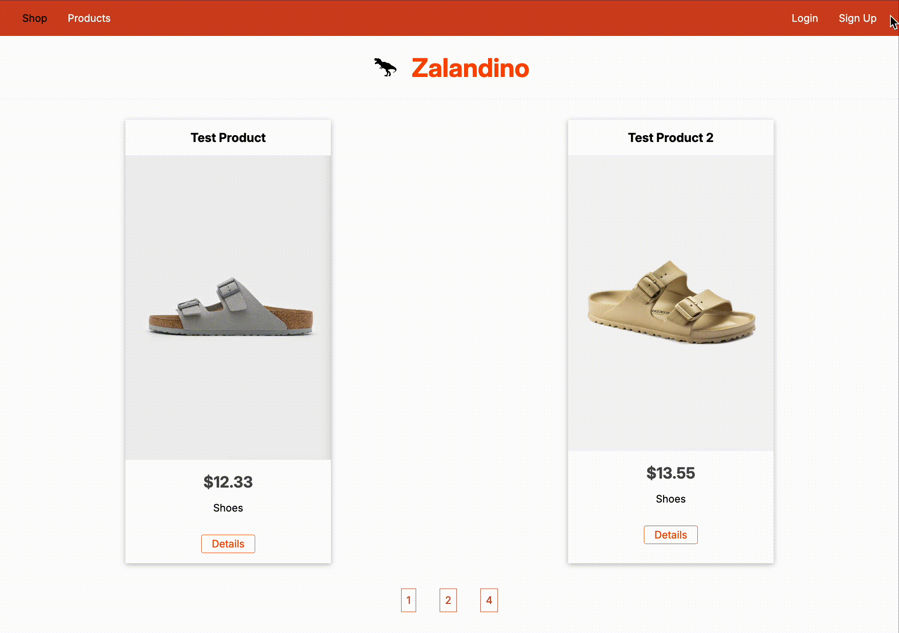

# 🦕🛍️ Zalandino – Full-Stack E-Commerce Website

**Zalandino** is a full-stack e-commerce web application inspired by Zalando. It supports secure user authentication, real-time product updates, payment processing with Stripe, and more.


---

## 🚀 Live Demo on Render

https://zalandino.onrender.com

---

## 📌 Features

- **User Authentication**

  - Secure local signup & login using bcrypt
  - Session management via express-session + MongoDB store
  - Flash messages for user feedback

- **Security & Performance**

  - Helmet for HTTP header protection
  - Compression middleware to optimize response size
  - Content Security Policy (CSP) manually configured for production

- **Product & Cart Management**

  - Add, edit, and delete products (with image uploads using Multer + AWS S3)
  - Real-time quantity and price updates (Socket.IO)

- **Checkout & Payments**

  - Stripe integration for secure payments
  - Auto-generated PDF invoice using PDFKit
  - Order history and cart clearance upon checkout

- **Email Notifications**

  - Signup + password reset email confirmations
  - Using time-limited secure tokens for password reset
  - (Currently in testing via single sender verification; no custom domain yet)

- **Testing**
  - Unit tests for authentication using Mocha, Chai, and Sinon
  - Testable middleware for route protection

---

## 🎥 Live Demos

**Input Validation & Authentication**

- Validator + Flash messages for instant input feedback
- Dynamic header for logged-in users vs. visitors



**Checkout & PDF Invoice Download**

- Payment done using Stripe
- Auto-generated PDF invoices after purchase


**Real-Time Updates**

- Left: Admin Dashboard, Right: Client View
- Real-time updates of the shop powered by socket.io


## 🛠️ Tech Stack

| Category            | Tech Used                       |
| ------------------- | ------------------------------- |
| **Backend**         | Node.js, Express.js             |
| **Frontend**        | EJS                             |
| **Database**        | MongoDB with Mongoose ORM       |
| **Auth & Security** | bcrypt, express-session, Helmet |
| **File Uploads**    | AWS S3 + Multer                 |
| **Email Service**   | Nodemailer + SendGrid Transport |
| **Payments**        | Stripe API                      |
| **Real-time**       | Socket.IO                       |
| **PDF Generation**  | PDFKit                          |
| **Testing**         | Mocha, Chai, Sinon              |
| **Version Control** | Git & GitHub                    |
| **Deployment**      | Render                          |

---

## 💻 Installation & Setup

### Installation

```bash
git clone https://github.com/yourusername/zalandino.git
cd zalandino
npm install
```

### Environment Variables

Create a .env file in the root directory with the following keys:

```bash
MONGODB_URI=               # Your MongoDB connection string
TESTMONGODB_URI=           # Used during test runs

SESSION_SECRET=            # Session encryption secret

STRIPE_PK=                 # Stripe public key
STRIPE_SK=                 # Stripe secret key
STRIPE_WEBHOOK_SECRET=     # Stripe webhook signing secret

NODEMAILER_API_KEY=        # SendGrid API key for email delivery

AWS_ACCESS_KEY_ID=         # Your AWS IAM Access Key
AWS_SECRET_ACCESS_KEY=     # Your AWS IAM Secret Key
AWS_REGION=                # e.g. eu-north-1
```
